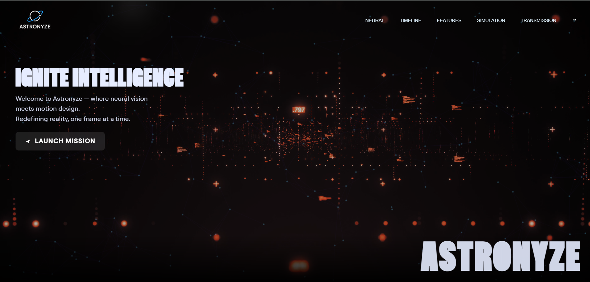

# 🧠 NeuroSpark – Reactive Neural UI

NeuroSpark is a futuristic, perception-driven interface framework inspired by the fusion of **brain-computer interaction**, **visual cognition**, and **emotive design**. Built with **React**, **TailwindCSS**, and **GSAP**, it offers a fully responsive UI that reacts to user gaze, emotion, and motion — pioneering the future of intuitive digital interaction.

  


---

## 🚀 Features

- 🎥 **Reactive Video Cards** – Real-time motion and AI-driven interface videos.
- 🧊 **Bento-Style Image Grid** – Emotive UI cards with hover tilts & neural glow.
- 🎮 **Neural Use Cases** – Showcase real-world BCI + UX possibilities.
- 🧬 **GSAP Scroll Animations** – Ultra-smooth transitions without lag.
- 🎯 **Custom CTA & Footer** – Designed for developer engagement and branding.
- 🌌 **Futuristic Gradients & Effects** – Fully themed dark-glow backgrounds.

---

## 🛠️ Built With

- **React.js** – Component-based UI
- **Tailwind CSS** – Utility-first styling
- **GSAP + ScrollTrigger** – High-performance scroll animations
- **React Icons** – Elegant iconography
- **HTML5 Video / Image** – For visual storytelling

---

## 📁 Project Structure

src/
│
├── components/
│ ├── Features.jsx # Main feature showcase (bento grid)
│ ├── UseCases.jsx # Real-world applications
│ ├── CtaSection.jsx # Call-to-action block
│ ├── Footer.jsx # Footer with logo grid
│ ├── BentoTilt.jsx # Reusable tilt card component
│
├── assets/
│ ├── images/ # Feature & use case visuals
│ ├── videos/ # Background video media
│ └── logos/ # Partner & project logos
│
└── App.jsx / index.js # Main React entry


## 🧪 Installation & Setup

```bash
# 1. Clone the repo
git clone https://github.com/yourusername/neurospark.git
cd neurospark

# 2. Install dependencies
npm install

# 3. Start the dev server
npm run dev

🙌 Contributing
Pull requests are welcome!
If you'd like to improve animations, add use cases, or build neural API backends — let's collaborate.

📄 License
This project is licensed under the MIT License.
Feel free to use it for personal, portfolio, or experimental projects.

💡 Credits
Designed & Developed by Krishna sahu

Inspired by futuristic interfaces & real-world BCI experiments 
contact:krishna.sahu.work@gmail.com

